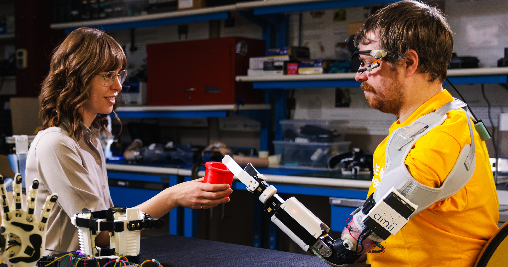

---
# Feel free to add content and custom Front Matter to this file.
# To modify the layout, see https://jekyllrb.com/docs/themes/#overriding-theme-defaults
# 
# **NOTE:** The best way to use these is to turn feature on or off by editing the `collections` attribute in `_config.yml`.

permalink: /
title: Home 
layout: home

---

Machine Learning and Medical Robotics Workshop
---

Medical robotic systems aim to improve medical service quality in medical procedures and patient care. Engineering such systems that are generally applicable can often take immense time for several reasons, including patients' individual needs, such as with prosthetics, or due to difficulties interacting with the natural world (e.g., modelling forces with teleoperation systems). Addressing these problems has sparked a growing interest in applying machine learning methods to medical robotic applications, with the goal of learning either end-to-end systems or modular components that can help mitigate the challenges of typical hand-engineered solutions. Moving from more theoretical or proof-of-concept research to high-impact, translational research that addresses real-world problems necessarily involves connecting with domain experts as well as target groups the research should serve. In medical settings, this includes healthcare providers and patients. Given the acceleration of work at the intersection of machine learning and medical robotics, developing a community of shared technical language, awareness and understanding of ongoing challenges, and interdisciplinary collaboration is critical. Our goal in this workshop is to serve as a venue to help connect researchers at all stages of their careers and foster collaborations between researchers with expertise across many important topics within and between machine learning and medical robotics such that they may continue addressing real-world problems with innovative solutions and improve medical service quality.

In this workshop, we seek to bring together members of the medical robotics community and machine learning to discuss the practical considerations of deploying machine learning for areas of medical device development, including assistive care, imaging, and other related technologies. Together, we hope to address a variety of essential considerations, such as:  

1. How can machine learning enhance the quality of life of patients?
2. Is increasing the dataset size practical in medical machine learning applications? Is scale all we need to incorporate machine learning methods in medical devices? 
3. How can we design our experimental evaluations to reflect the needs of the target populations affected by a medical condition (disability, disease, or otherwise)? 
4. What assumptions should we consider when investigating machine learning applications in a medical setting? 
5. How do we go from research to real world deployment for our advances in machine learning, particularly when government approval will be of pragmatic concern for deploying such systems? 
 

Important Links : 
1. [**Speakers**](speakers) 
2. [**Organizers**](organizers)
3. [**Schedule**](schedule)
4. [**Papers**](papers)

---
